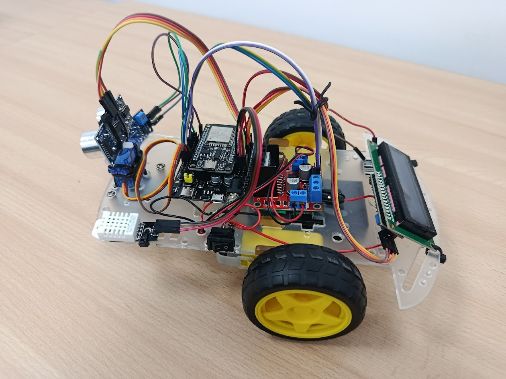
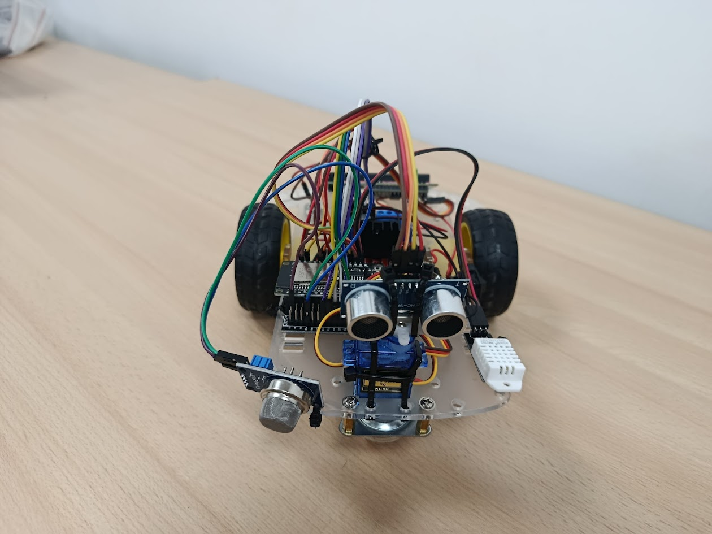
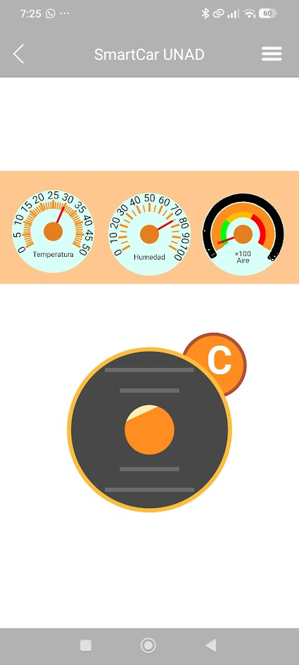
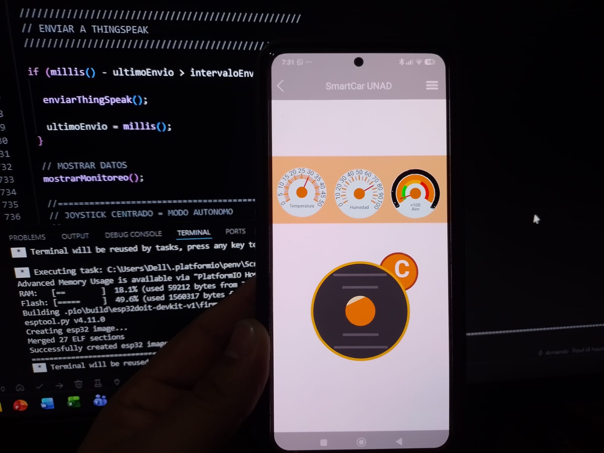
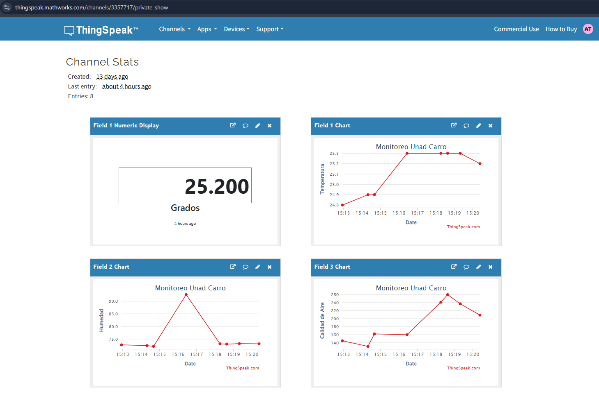

# 🤖 SmartCar UNAD - Robot Autónomo Ambiental

Proyecto desarrollado con ESP32 para el monitoreo ambiental móvil y navegación autónoma utilizando sensores ambientales, control remoto mediante RemoteXY y almacenamiento de datos en ThingSpeak.

---

# 📌 Descripción del Proyecto

SmartCar UNAD es un robot autónomo capaz de:

- Detectar obstáculos automáticamente.
- Monitorear temperatura y humedad ambiental.
- Medir calidad del aire mediante sensor MQ2.
- Mostrar información en pantalla LCD.
- Ser controlado manualmente desde un teléfono móvil mediante Bluetooth.
- Operar en modo autónomo cuando el joystick está centrado.
- Enviar datos ambientales a ThingSpeak para monitoreo IoT en tiempo real.
- Emitir alertas sonoras mediante buzzer.

---
# 🎓 Contexto Académico

Proyecto desarrollado para el laboratorio del curso de **Microprocesadores y Microcontroladores** de la **Universidad Nacional Abierta y a Distancia (UNAD)**.

Tutor académico:

**Ing. Javier Mauricio Ríos**

El proyecto integra conceptos de:

- Sistemas embebidos
- Sensórica
- Automatización
- Robótica móvil
- Internet de las Cosas (IoT)
- Programación de microcontroladores ESP32

---

# 🚗 Características Principales

## ✅ Modo Manual

Control mediante joystick desde la aplicación RemoteXY:

- Adelante
- Atrás
- Giro izquierda
- Giro derecha

---

## ✅ Modo Autónomo

Cuando el joystick está centrado:

- Avanza automáticamente.
- Detecta obstáculos con sensor ultrasónico.
- Analiza mejor ruta con servo.
- Evita colisiones.
- Retrocede y gira automáticamente.

---

## ✅ Monitoreo Ambiental

Sensores integrados:

| Sensor | Función |
|---|---|
| DHT22 | Temperatura y humedad |
| MQ2 | Calidad del aire / gases |


---

## ✅ IoT con ThingSpeak 
Web: https://thingspeak.mathworks.com/

Los datos ambientales son enviados automáticamente a la nube:

- Temperatura
- Humedad
- Calidad del aire

---

# 🧰 Componentes Utilizados

| Componente | Cantidad |
|---|---|
| ESP32 | 1 |
| Driver L298N | 1 |
| Motores DC | 2 |
| Sensor DHT22 | 1 |
| Sensor MQ2 | 1 |
| Sensor HC-SR04 | 1 |
| Servo SG90 | 1 |
| LCD I2C 16x2 | 1 |
| Buzzer | 1 |
| Baterías 3.7V | 2 |
| Chasis Robot | 1 |

---

# 🔌 Distribución de Pines

## Motores

| Función | Pin ESP32 |
|---|---|
| IN1 | 26 |
| IN2 | 27 |
| ENA | 33 |
| IN3 | 14 |
| IN4 | 12 |
| ENB | 25 |

---

## Sensores

| Sensor | Pin |
|---|---|
| DHT22 | 15 |
| MQ2 | 34 |
| TRIG HC-SR04 | 4 |
| ECHO HC-SR04 | 2 |
| Servo | 13 |
| Buzzer | 18 |

---

# 📱 Aplicación RemoteXY

Web: https://remotexy.com/

El robot utiliza RemoteXY mediante Bluetooth para:

- Control manual
- Visualización de sensores
- Supervisión remota

## Configuración Bluetooth

```cpp
#define REMOTEXY_BLUETOOTH_NAME "SmartCar UNAD"
```

---

# ☁️ Integración con ThingSpeak

El proyecto envía datos automáticamente a ThingSpeak usando WiFi.

## Campos utilizados

| Field | Variable |
|---|---|
| Field 1 | Temperatura |
| Field 2 | Humedad |
| Field 3 | Calidad de aire MQ2 |

## API utilizada

```http
GET https://api.thingspeak.com/update?api_key=TU_API_KEY
```

---

# 🧠 Lógica de Funcionamiento

## Modo Autónomo

1. El robot mide distancia frontal.
2. Si el camino está libre:
   - Avanza.
3. Si detecta obstáculo:
   - Retrocede.
   - Analiza izquierda y derecha.
   - Escoge la mejor ruta.
4. Si detecta alta concentración de gas:
   - Detiene motores.
   - Activa alarma.
   - Muestra alerta en LCD.

---

# 🔊 Sistema de Alarmas

El buzzer se activa cuando:

- Existe alta concentración de gas.
- Se detecta obstáculo cercano.

---

# 📟 Pantalla LCD

La pantalla LCD muestra:

- Temperatura
- Humedad
- Calidad del aire
- Estado del robot
- Direcciones de movimiento
- Alertas del sistema

---

# ⚙️ Librerías Utilizadas

```cpp
#include <Arduino.h>
#include <Wire.h>
#include <LiquidCrystal_I2C.h>
#include <ESP32Servo.h>
#include <DHT.h>
#include <WiFi.h>
#include <WiFiClient.h>
#include <RemoteXY.h>
```

---

# 🛠️ Configuración PlatformIO

Archivo `platformio.ini`

```ini
[env:esp32doit-devkit-v1]
platform = espressif32
board = esp32doit-devkit-v1
framework = arduino
board_build.partitions = huge_app.csv
lib_deps =
    marcoschwartz/LiquidCrystal_I2C@^1.1.4
    madhephaestus/ESP32Servo@^3.2.0
    adafruit/DHT sensor library@^1.4.6
    adafruit/Adafruit Unified Sensor@^1.1.14
    remotexy/RemoteXY@^4.1.10
```

---

# ▶️ Instalación

## 1. Clonar repositorio

```bash
git clone https://github.com/atroutg/SmartCar.git
```

---

## 2. Abrir en VS Code + PlatformIO

Instalar:

- PlatformIO
- Librerías necesarias

---

## 3. Configurar WiFi

Modificar:

```cpp
const char* ssid = "TU_WIFI";
const char* password = "TU_PASSWORD";
```

---

## 4. Configurar ThingSpeak

Modificar:

```cpp
String apiKey = "TU_API_KEY";
```

---

## 5. Compilar y subir

```bash
pio run
pio run --target upload
```

---

# 📊 Resultados Esperados

✅ Navegación autónoma  
✅ Control remoto Bluetooth  
✅ Monitoreo ambiental en tiempo real  
✅ Almacenamiento de datos IoT  
✅ Visualización LCD  
✅ Sistema de alertas  

---

# 📚 Tecnologías Utilizadas

- ESP32
- Arduino Framework
- RemoteXY
- ThingSpeak
- PlatformIO
- IoT
- Sensores ambientales

---

# 🖼️ Vista del Proyecto

## Robot SmartCar UNAD

Agregar aquí imágenes del robot:





## Aplicación RemoteXY





## Dashboard ThingSpeak





# 🌐 Plataforma IoT

Datos almacenados en:

- Temperatura
- Humedad
- Calidad del aire

Visualización en tiempo real mediante ThingSpeak.

---

# 🔋 Alimentación

El sistema utiliza:

- 2 baterías de 3.7V conectadas en serie
- Alimentación para:
  - ESP32
  - Motores
  - Sensores
  - LCD
  - Servo

---

# 🚨 Problemas Solucionados Durante el Desarrollo

## ✅ Falta de fuerza en motores

Se mejoró mediante:

- PWM máximo
- Alimentación en serie
- Ajuste de velocidades

---

## ✅ Problemas de memoria Flash

Solucionado usando:

```ini
board_build.partitions = huge_app.csv
```

y reemplazando:

```cpp
HTTPClient
```

por:

```cpp
WiFiClient
```

---

# 🎯 Objetivos del Proyecto

- Implementar navegación autónoma.
- Integrar monitoreo ambiental.
- Aplicar tecnologías IoT.
- Controlar robot mediante Bluetooth.
- Enviar datos a la nube.
- Integrar múltiples sensores en ESP32.

---

# 🏫 Contexto Académico

Proyecto desarrollado con fines académicos para la Universidad Nacional Abierta y a Distancia (UNAD), aplicando conceptos de:

- Internet de las Cosas (IoT)
- Sistemas embebidos
- Automatización
- Sensórica
- Robótica móvil

---

# 👨‍💻 Autor

Proyecto desarrollado por Armando Trout Garcia

---

# 📄 Licencia

Proyecto de uso académico y educativo.

---

# ⭐ Repositorio

Si este proyecto te resulta útil, puedes darle una estrella ⭐ al repositorio.